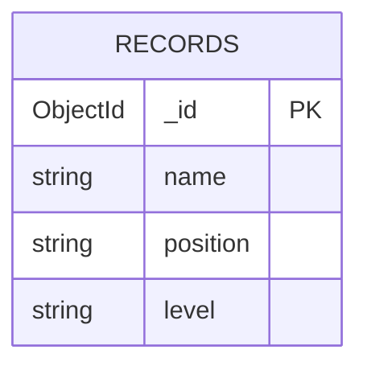

# EDD — Entity Document Diagram

Data model for the **MERN Stack Employee Records App**.

- **Database**: `employees`
- **Driver**: MongoDB Node.js Driver 6

---

## Entities

### Record    [collection: records]    [indexes: {_id:1}]

```
_id:       ObjectId
name:      string        # employee full name
position:  string        # job title / role
level:     string        # new/updated records: "Intern", "Junior", or "Senior"
```

---

## Relationships

```
records  — standalone collection, no references to other collections
```

---

## Mermaid Diagram



---

## Notes

- No validation schema is enforced at the database level. The form and Express POST/PATCH routes require a nonblank string `name`, a string `position` of at least 2 characters after trimming, and a `level` equal to `Intern`, `Junior`, or `Senior`.
- Invalid writes return HTTP 400 with an `errors` object keyed by field; the form displays these errors inline and retains input on failed saves.
- Existing seed data may contain legacy lowercase levels (`junior`, `mid`, `senior`). These records are unchanged; edits must use one of the allowed levels.
