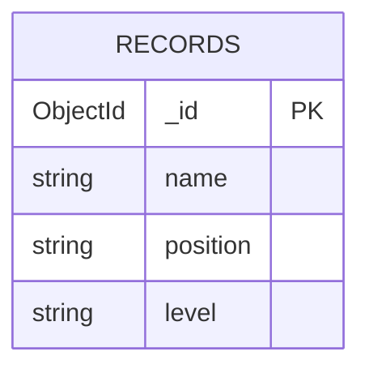

# EDD — Entity Document Diagram

Data model for the **MERN Stack Employee Records App**.

- **Database**: `employees`
- **Driver**: MongoDB Node.js Driver 6

---

## Entities

### Record    [collection: records]    [indexes: {_id:1}]

```
_id:       ObjectId
name:      string        # required employee full name (non-blank)
position:  string        # job title / role, at least 2 characters after trimming
level:     string        # one of "Intern", "Junior", "Senior"
```

---

## Relationships

```
records  — standalone collection, no references to other collections
```

---

## Mermaid Diagram



---

## Notes

- No validation schema is enforced at the database level. Express POST and PATCH routes validate all three fields before writing and return HTTP 400 with field-specific `errors` for invalid input.
- Both the form and API require a non-blank string `name`, a string `position` with at least 2 characters after trimming, and a `level` of exactly `Intern`, `Junior`, or `Senior`. Names and positions are trimmed before saving.
- Existing seed records may contain legacy lowercase levels (`junior`, `mid`, `senior`). The edit form normalizes known levels; unsupported legacy levels must be replaced with an allowed selection before saving.
